# ERD v1.0 — Sistem Absensi Madrasah

**Basis:** Data Model Specification v1.0, BRD v1.3, Functional Specification v2.0  
**Database target:** PostgreSQL / Supabase  
**Version:** 1.0  
**Tanggal:** 23 September 2026

## 1. ERD Utama

> Diagram menggunakan Mermaid ERD. Dapat dirender di GitHub, VS Code dengan extension Mermaid, atau editor Mermaid.

```mermaid
erDiagram

    auth_users {
        uuid id PK
    }

    users {
        uuid id PK
        text full_name
        text email UK
        varchar phone
        boolean is_active
        timestamptz created_at
        timestamptz updated_at
    }

    roles {
        uuid id PK
        varchar code UK
        varchar name
        text description
    }

    user_roles {
        uuid user_id PK, FK
        uuid role_id PK, FK
        timestamptz created_at
    }

    madrasah {
        uuid id PK
        text name
        text address
        numeric latitude
        numeric longitude
        numeric geofence_radius_meter
        numeric max_gps_accuracy_meter
        timestamptz created_at
        timestamptz updated_at
    }

    teachers {
        uuid id PK
        uuid user_id FK
        uuid madrasah_id FK
        varchar nik UK
        text full_name
        text subject
        text photo_url
        varchar phone
        boolean is_active
        timestamptz created_at
        timestamptz updated_at
    }

    students {
        uuid id PK
        uuid user_id FK
        uuid madrasah_id FK
        varchar nisn UK
        text full_name
        text major
        text photo_url
        varchar phone
        boolean is_active
        timestamptz created_at
        timestamptz updated_at
    }

    academic_periods {
        uuid id PK
        uuid madrasah_id FK
        varchar name
        date start_date
        date end_date
        boolean is_active
        timestamptz created_at
        timestamptz updated_at
    }

    classes {
        uuid id PK
        uuid madrasah_id FK
        uuid academic_period_id FK
        varchar name
        varchar code
        varchar grade_level
        boolean is_active
        timestamptz created_at
        timestamptz updated_at
    }

    student_class_memberships {
        uuid id PK
        uuid academic_period_id FK
        uuid student_id FK
        uuid class_id FK
        date start_date
        date end_date
        boolean is_active
        timestamptz created_at
        timestamptz updated_at
    }

    class_homeroom_assignments {
        uuid id PK
        uuid academic_period_id FK
        uuid class_id FK
        uuid teacher_id FK
        date start_date
        date end_date
        boolean is_active
        timestamptz created_at
        timestamptz updated_at
    }

    standard_schedules {
        uuid id PK
        uuid academic_period_id FK
        int day_of_week
        time arrival_time
        time departure_time
        boolean is_active
        timestamptz created_at
        timestamptz updated_at
    }

    special_calendar_dates {
        uuid id PK
        uuid academic_period_id FK
        date calendar_date
        varchar day_type
        time arrival_time
        time departure_time
        text reason
        timestamptz created_at
        timestamptz updated_at
    }

    teacher_schedule_overrides {
        uuid id PK
        uuid academic_period_id FK
        uuid teacher_id FK
        date override_date
        time arrival_time
        time departure_time
        text reason
        timestamptz created_at
        timestamptz updated_at
    }

    attendance_records {
        uuid id PK
        uuid academic_period_id FK
        uuid teacher_id FK
        uuid student_id FK
        date attendance_date
        varchar category
        varchar status
        timestamptz checked_at
        numeric latitude
        numeric longitude
        numeric distance_meter
        numeric gps_accuracy_meter
        uuid scanner_teacher_id FK
        timestamptz created_at
        timestamptz updated_at
    }

    leave_types {
        uuid id PK
        varchar code UK
        varchar name
        varchar actor_type
        boolean is_active
        timestamptz created_at
    }

    leave_requests {
        uuid id PK
        uuid academic_period_id FK
        uuid student_id FK
        uuid teacher_id FK
        uuid leave_type_id FK
        date start_date
        date end_date
        text reason
        varchar status
        uuid submitted_by_user_id FK
        timestamptz submitted_at
        timestamptz created_at
        timestamptz updated_at
    }

    leave_attachments {
        uuid id PK
        uuid leave_request_id FK
        text file_name
        text storage_path
        varchar mime_type
        bigint file_size_bytes
        timestamptz created_at
    }

    leave_approvals {
        uuid id PK
        uuid leave_request_id FK
        uuid approver_user_id FK
        varchar action
        text note
        timestamptz acted_at
        timestamptz created_at
    }

    attendance_correction_requests {
        uuid id PK
        uuid attendance_record_id FK
        uuid requested_by_teacher_id FK
        timestamptz requested_at
        jsonb requested_changes
        text reason
        varchar status
        uuid reviewed_by_user_id FK
        timestamptz reviewed_at
        text review_note
        timestamptz created_at
        timestamptz updated_at
    }

    audit_logs {
        uuid id PK
        uuid actor_user_id FK
        varchar action
        varchar entity_type
        uuid entity_id
        jsonb before_data
        jsonb after_data
        timestamptz created_at
    }

    import_batches {
        uuid id PK
        uuid academic_period_id FK
        varchar import_type
        text file_name
        varchar status
        int total_rows
        int success_rows
        int failed_rows
        uuid uploaded_by_user_id FK
        timestamptz created_at
    }

    import_errors {
        uuid id PK
        uuid import_batch_id FK
        int row_number
        varchar field_name
        varchar error_code
        text error_message
        jsonb raw_data
        timestamptz created_at
    }

    auth_users ||--o| users : "identity"
    users ||--o{ user_roles : has
    roles ||--o{ user_roles : assigned

    madrasah ||--o{ teachers : employs
    madrasah ||--o{ students : contains
    madrasah ||--o{ academic_periods : has

    users ||--o| teachers : profile
    users ||--o| students : profile

    academic_periods ||--o{ classes : contains
    academic_periods ||--o{ student_class_memberships : scopes
    students ||--o{ student_class_memberships : history
    classes ||--o{ student_class_memberships : contains

    academic_periods ||--o{ class_homeroom_assignments : scopes
    classes ||--o{ class_homeroom_assignments : assigned
    teachers ||--o{ class_homeroom_assignments : homeroom

    academic_periods ||--o{ standard_schedules : defines
    academic_periods ||--o{ special_calendar_dates : overrides
    academic_periods ||--o{ teacher_schedule_overrides : scopes
    teachers ||--o{ teacher_schedule_overrides : overrides

    academic_periods ||--o{ attendance_records : scopes
    teachers ||--o{ attendance_records : owns
    students ||--o{ attendance_records : owns
    teachers ||--o{ attendance_records : scans

    leave_types ||--o{ leave_requests : classifies
    academic_periods ||--o{ leave_requests : scopes
    students ||--o{ leave_requests : requests
    teachers ||--o{ leave_requests : requests
    users ||--o{ leave_requests : submits

    leave_requests ||--o| leave_attachments : attachment
    leave_requests ||--o{ leave_approvals : history
    users ||--o{ leave_approvals : approves

    attendance_records ||--o{ attendance_correction_requests : corrections
    teachers ||--o{ attendance_correction_requests : requests
    users ||--o{ attendance_correction_requests : reviews

    users ||--o{ audit_logs : acts

    academic_periods ||--o{ import_batches : scopes
    users ||--o{ import_batches : uploads
    import_batches ||--o{ import_errors : contains
```



## 2. Relationship Rules

| Parent | Child | Cardinality | Key Rule |
|---|---|---:|---|
| `users` | `user_roles` | 1:N | User dapat memiliki banyak role |
| `roles` | `user_roles` | 1:N | Role dapat dimiliki banyak user |
| `madrasah` | `teachers` | 1:N | Guru terikat pada madrasah |
| `madrasah` | `students` | 1:N | Siswa terikat pada madrasah |
| `madrasah` | `academic_periods` | 1:N | Maksimal satu periode aktif per madrasah |
| `academic_periods` | `classes` | 1:N | Kelas terikat periode |
| `students` | `student_class_memberships` | 1:N | Riwayat kelas tidak ditimpa |
| `classes` | `student_class_memberships` | 1:N | Satu kelas berisi banyak siswa |
| `classes` | `class_homeroom_assignments` | 1:N | History wali kelas |
| `teachers` | `class_homeroom_assignments` | 1:N | Guru dapat menjadi wali kelas |
| `academic_periods` | `standard_schedules` | 1:N | Jadwal standar |
| `academic_periods` | `special_calendar_dates` | 1:N | Kalender khusus |
| `teachers` | `teacher_schedule_overrides` | 1:N | Override per guru/tanggal |
| `teachers` | `attendance_records` | 1:N | Attendance guru |
| `students` | `attendance_records` | 1:N | Attendance siswa |
| `teachers` | `attendance_records` via `scanner_teacher_id` | 1:N | Guru scanner attendance siswa |
| `leave_requests` | `leave_attachments` | 1:0..1 | Maksimal satu lampiran |
| `leave_requests` | `leave_approvals` | 1:N | Approval history |
| `attendance_records` | `attendance_correction_requests` | 1:N | Riwayat koreksi |
| `users` | `audit_logs` | 1:N | Semua perubahan penting dapat diaudit |
| `import_batches` | `import_errors` | 1:N | Error per row import |

## 3. Constraint Penting

### 3.1 Attendance owner XOR

Satu `attendance_records` harus dimiliki **tepat satu** entity:

```text
teacher_id IS NOT NULL AND student_id IS NULL
OR
teacher_id IS NULL AND student_id IS NOT NULL
```

### 3.2 Student attendance scanner

Jika attendance milik siswa:

```text
scanner_teacher_id IS NOT NULL
```

Jika attendance milik guru:

```text
scanner_teacher_id IS NULL
```

### 3.3 Anti duplicate

```text
teacher_id + attendance_date + category
```

atau

```text
student_id + attendance_date + category
```

harus unique.

### 3.4 Leave owner XOR

Satu `leave_requests` harus terkait tepat satu:

```text
student_id
```

atau:

```text
teacher_id
```

### 3.5 Period isolation

Entity period-scoped:

- `classes`
- `student_class_memberships`
- `class_homeroom_assignments`
- `standard_schedules`
- `special_calendar_dates`
- `teacher_schedule_overrides`
- `attendance_records`
- `leave_requests`
- `import_batches`

harus membawa `academic_period_id`.

## 4. Effective Schedule

ERD **tidak** memiliki tabel `effective_schedules`.

Effective schedule dihitung dari:

```text
special_calendar_dates
        ↓
holiday?
 ┌──────┴──────┐
yes           no
 ↓             ↓
NO ATTENDANCE  special schedule
                     ↓
              teacher override
                     ↓
              standard schedule
```

## 5.5 Daily Status

ERD **tidak** memiliki tabel `daily_attendance_status`.

Status harian dihitung dari:

```text
attendance_records
+
effective schedule
+
attendance window
+
leave_requests
```

Dengan demikian `ABSENT`, `NOT_YET_CHECKED_OUT`, dan `LEAVE_PENDING_APPROVAL` tidak menjadi duplicate source of truth.

## 6. Entity yang Tidak Dibuat

| Entity | Alasan |
|---|---|
| `effective_schedules` | Derived result, bukan master |
| `daily_attendance_status` | Derived status |
| `qr_codes` | QR static berbasis NISN |
| `devices` | Device information di luar scope |

## 7. Basis Sumber

ERD ini diturunkan dari:

- BRD Sistem Absensi Madrasah v1.3
- Functional Specification Sistem Absensi Madrasah v2.0
- Data Model Specification v1.0

Functional Specification menjelaskan bahwa dokumen tersebut menjadi dasar Data Model tetapi tidak menetapkan struktur DB final; karena itu cardinality, physical table structure, indexes, dan SQL constraints di sini merupakan keputusan desain implementasi.
